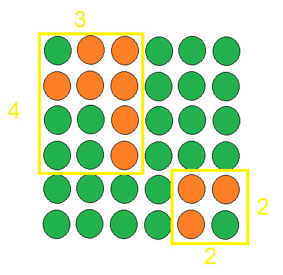
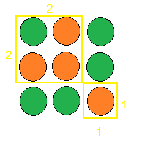

# Task 01

Горските пожари са сериозен проблем. Помните Австралия.

Разполагате с квадратна карта на гора. С 0 са обозначени дървета, които са добре, а с 1 - горящи такива. За гасенето на пожарите са необходими много литри вода. Правителството обаче има нужда от помощта ви. Тъй като дърветата не могат да бъдат гасени едно по едно, от вас се иска да кажете какво е лицето на обграждащата площ (bounding box) на всеки горящ регион от гората.

## Input Format

На първия ред прочитате цяло число `N`.

Следва гората, представена като квадратна матрица със страна `N`.

Гарантирано е, че в матрицата има поне 1 клетка с 1.

## Constraints

```
1 ≤ N ≤ 4000
```

## Output Format

На един ред на стандартния изход, разделени с интервал, изведете в намаляващ ред площите на всеки от споменатите региони. Виж примера за по-добра визуализация.

Note: Приемете, че покриващите площи не се припокриват.

## Sample Input 0

```
6

0 1 1 0 0 0

1 1 1 0 0 0

0 0 1 0 0 0

0 0 1 0 0 0

0 0 0 0 1 1

0 0 0 0 1 0
```


## Sample Output 0

```
12 4
```

## Explanation 0



## Sample Input 1

```
3

0 1 0

1 1 0

0 0 1
```


## Sample Output 1

```
4 1
```

## Explanation 1



Обърнете внимание, че дърветата не са съседни по диагонал.

***

# Task 02

Отново наближава 8-ми декември и няма как да пропуснете студентския празник. Тъй като обаче си спомняте какво се случи миналата година (поне някаква малка част), искате историята по възможност да не се повтаря.

Имате някакво време поне до 8-ми, така че като един самоуважаващ себе си програмист, решавате да напишете програма, която да ви помогне, когато сте в най-голяма нужда или иначе казано - на един конкретен вид овошка. Искате във всеки момент, когато някой ваш приятел е в определено състояние, програмата да може да изчисли разстоянието до най-близкия му приятел. Програмата трябва да може да ви каже какво е най-малкото разстояние между двама човека във вашата група от приятели.

Тъй като наскоро сте учили графи и в някакъв момент на 8-ми само графи ще виждате, решавате да представите хората, с които празнувате като граф. Тъй като празнувате с много хора обаче, не всички са ви приятели, та всеки човек си има номер на приятелска група, с която дружи.

Върховете на графа с хората, с които ще празнувате и ако между два върха има ребро, това значи, че единия може да стигне до другия. Приемаме, че разстоянието между тях е 1. Трябва да намерите за всеки човек на партито най-краткото разстояние до друг човек от неговата приятелска група.

Върховете са номерирани от 1 до N и също така приятелските групи също са номерирани.

## Input Format

На първия ред се въвеждат 2 числа - N и M. Това са съответно броя върхове в графа и броя ребра.

На следващите M реда се въвеждат по две числа u и v - индексите на два върха, между които има ребро.

На следващия ред се въвеждат N числа - номера на приятелската група за всеки връх в графа.

На последния ред се въвежда едно число - номерът на вашата приятелска група.

## Constraints

```
1 ≤ N ≤ 10^6

1 ≤ M ≤ 10^6
```

Номерата на приятелските групи не надвишават 10^6

## Output Format

Извежда се само едно число - търсеният най-кратък път между двама души във вашата приятелска група.

## Sample Input 0

```
4 3

2 1

3 1

2 4

2 1 2 2

2
```

## Sample Output 0

```
1
```

## Sample Input 1

```
5 4

2 1

3 1

4 2

5 3

3 2 1 1 2

2
```

## Sample Output 1

```
3
```

***

# Task 03

Вие сте археолог с OCD (обсесивно компулсивно разтройство). При разкопки намирате древни текстове на непознат за човечеството досега език. Формата и подредбата на текста ви подказват, че това може да е речник. Вие допускате, че речниците както сега, така и в древността, са били подредени по азбучен ред.

Към момента не ви интересува какво точно е значението на всяка дума. Искате да разберете единствено какъв е бил редът на символите в азбуката на древния народ.

## Input Format

На първият ред на стандартния вход ще прочетете цяло число `N`.

От следващите `N` реда на стандартния вход ще прочетете символни низове `S_i`, подредени по азбучен ред, според азбуката на древния народ. Всички низове ще съдържат само малки латински букви.

## Constraints

```
1 ≤ N ≤ 100

3 ≤ length of S_i ≤ 30
```

## Output Format

Използвайки данните, с които разполагате, на един ред, разделени с интервал отпечатайте символите от азбуката на древния народ, в правилната за тях лексикографска наредба.

## Sample Input 0

```
5

tqq

qtiu

qtiq

iqt

iqu
```


## Sample Output 0

```
t u q i
```

***

# Task 04

След всички тези изпити, непосилни математики и досадни програмирания завършвате бакалавър във ФМИ.

След тези тягостни 7 години от живота ви решавате, че трябва да си намерите работа. За съжаление обаче не се предлага работа за програмисти, тъй като chat-GPT е заместило всички, понеже вече е овладяло прокрастинацията още по-добре от самите тях, а дори не му трябват почивки за кафе.

Все пак си намирате следващата най-добра работа, а именно - началник по градоустройството.

Първата ви задача е по няколко дадени новопостроени града да подсигурите културното им благоденствие. Тъй като имате ограничен бюджет, решавате да построите нещата от първа необходимост, а именно дискотеките.

Във всеки град може да построите дискотека и искате от всеки град да може да се стигне до град, в който има дискотека.

Има само два проблема. Първият е, че теренът, на който са построени градовете, позволява да се строят пътища само между някои от тях. Вторият е, че трябва да похарчите парите оптимално, че да останат поне за една библиотека, за да не ви мрънкат началниците.

## Input Format

На първия ред се въвежда бройката градоустройствени планове, които трябва да направите (бройката тестове).

За всеки градоустройствен план се въвеждат на първия ред броят на градовете - `N`, броят на възможните пътища - `M`, цената за строене на една дискотека - `K` и цената за строене на път между два града - `L`.

На всеки от следващите `M` реда се въвеждат по две числа `u` и `v` - два града, между които може да се построи път.

Номерата на градовете са от 1 до `N`.

## Constraints

```
1 ≤ N, M, K, L ≤ 10^5
```

## Output Format

За всеки градоустройствен план се извежда по едно число - минималната цена, с която може да постигнете целта си.

## Sample Input 0

```
2

3 3 3 2

2 1

1 3

3 2

6 6 3 5

1 3

3 4

2 4

1 2

2 3

5 6
```

## Sample Output 0

```
7

18
```

## Sample Input 1

```
1

6 4 2 3

1 2

1 3

4 5

4 6
```

## Sample Output 1

```
12
```

## Sample Input 2

```
1

5 3 6 1

1 2

1 3

1 4
```

## Sample Output 2

```
15
```

***

# Task 05

По време присъствието ви на кариерния форум на ФМИ печелите томбула, в която наградата е Лего комплект. Разбира се обаче, тъй като това е ФМИ, комплектът е купен от Али експрес, струва 50 стотинки и ще пристигне по Коледа.

Вие все пак сте много развълнувани за този пъзел и решавате да си купите друг такъв от кварталната бакалия и да си го наредите, понеже не ви се чака.

Пъзелът се състои от градове и пътища, но тъй като е от Али експрес, имате пътища само с дължина 1 или 2. Вие го нареждате, но сега се чудите как можете най-бързо да стигнете от един град до друг.

Сега задачата ви е да решите този проблем и да напишете програма, която намира най-краткия път между два дадени града в нареденото Лего.

## Input Format

На първия ред се въвеждат `N` и `M`.

На следващите `M` реда се дават по три числа - първите две са номерата на градовете, между които има път, a трето е дължината на пътя (1 или 2).

На последния ред се въвеждат 2 числа `startIndex` и `endIndex`.

## Constraints

```
1 ≤ N, M ≤ 10^6

Номерата на върховете са между 0 и N - 1

0 ≤ startIndex, endIndex ≤ N - 1
```

## Output Format

На един ред се извежда търсеният отговор - дължината на най-краткия път между двата `startIndex` и `endIndex`.

## Sample Input 0

```
8 7

1 2 2

1 3 1

2 4 2

3 4 1

4 5 1

5 6 2

6 7 1

1 7
```

## Sample Output 0

```
6
```